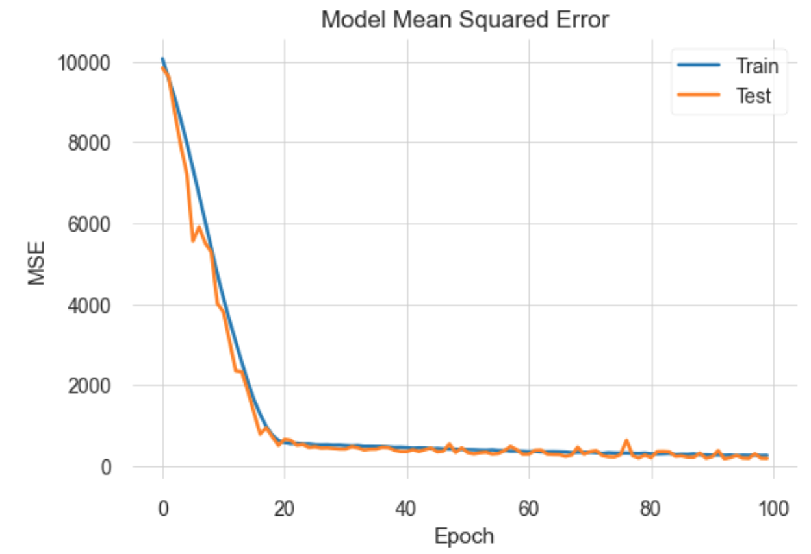

# Jet Engine Degradation Prediction


Prognostics and health management is an important topic in industry for predicting state of assets to avoid downtime and failures. This data set is the Kaggle version of the very well known public data set for asset degradation modeling from NASA. It includes Run-to-Failure simulated data from turbo fan jet engines.
Engine degradation simulation was carried out using C-MAPSS. Four different were sets simulated under different combinations of operational conditions and fault modes. Records several sensor channels to characterize fault evolution. The data set was provided by the Prognostics CoE at NASA Ames.

## Prediction Goal
The goal is to predict the remaining useful life (RUL) of turbo fan jet engines using NASA's C-MAPSS simulated sensor data.
RUL is equivalent of number of flights remained for the engine after the last datapoint in the test dataset.

## Installation
You can clone this repository using git:
```$ git clone https://github.com/boemer00/jet-engine-degradation-prediction.git```

Then, donwload the dataset directly from [NASA's repository](https://ti.arc.nasa.gov/tech/dash/groups/pcoe/prognostic-data-repository/).

## Results


## References
A. Saxena, K. Goebel, D. Simon, and N. Eklund, Damage Propagation Modeling for Aircraft Engine Run-to-Failure Simulation, in the Proceedings of the 1st International Conference on Prognostics and Health Management (PHM08), Denver CO, Oct 2008.
